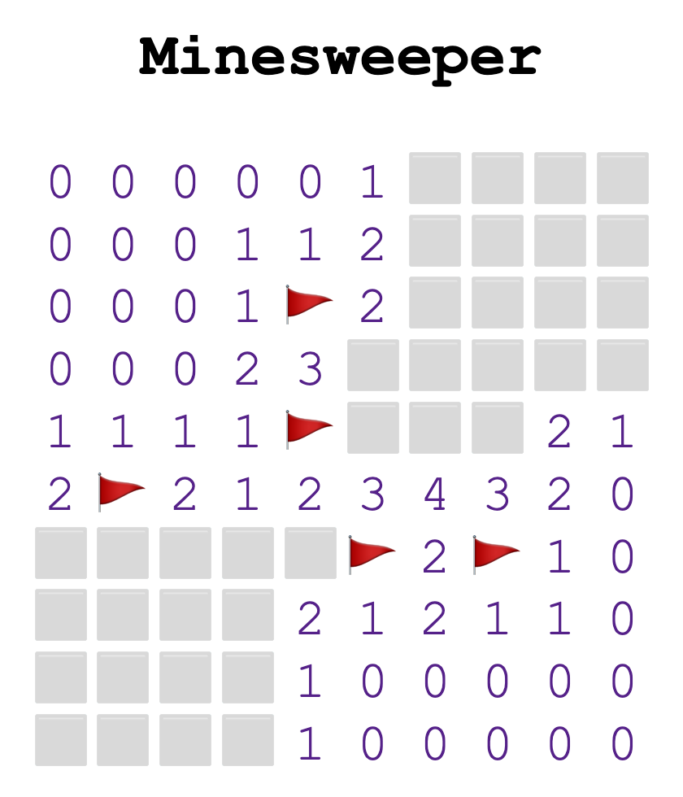
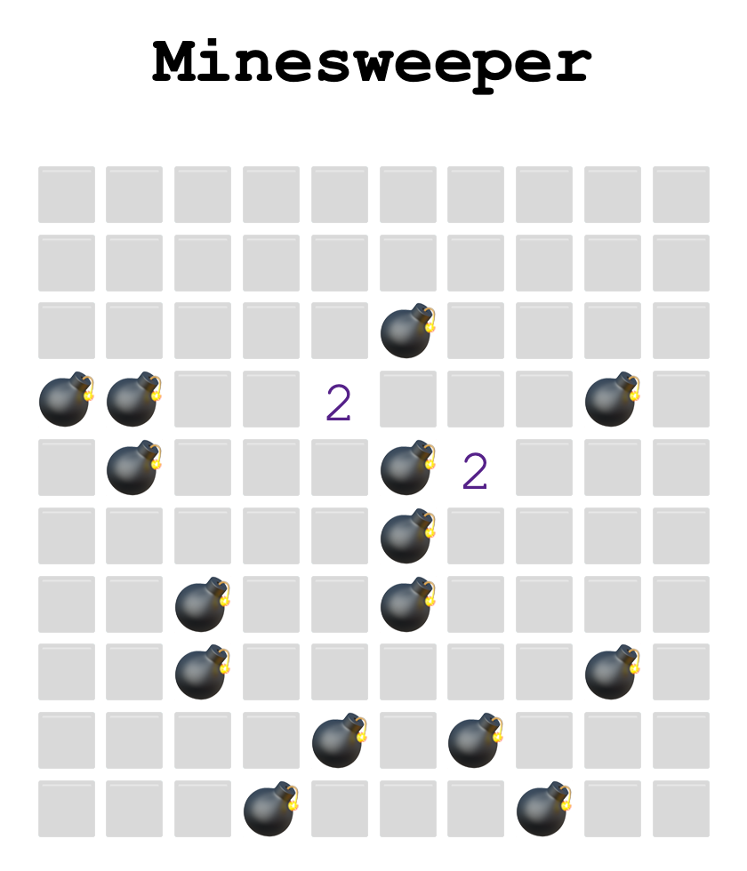

# minesweeper-rs
Minesweeper coded in Rust





### Features
* Fully functional gameplay
* Recursive opening of cells which do not touch mines
* Display bombs on loss

### TODO
* Win/Loss display
* Ability to start new game
* Customize width/height num mines

## How to use

Download and install Rust!
https://www.rust-lang.org/tools/install

Use [wasm-pack](https://github.com/rustwasm/wasm-pack) to create Rust generated WebAssembly. Go [here](https://rustwasm.github.io/wasm-pack/installer/) to download and install.

Then run the following command in the root directory to build the Rust project and generate WASM files.
```bash
wasm-pack build --target web
```

Use [serve](https://github.com/vercel/serve) to serve the static `index.html`.
```bash
npx serve
```

Then go to http://localhost:3000.

### Credits
Based on project by [yishn](https://github.com/yishn)
